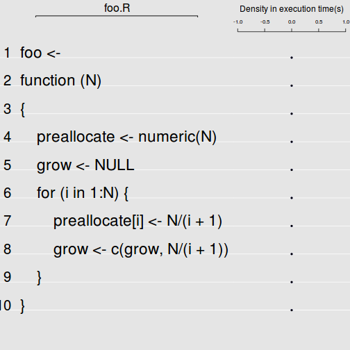

# Abstract
Test document for using aprof within markdown files.


# Introduction
Aprof should become aware of whether is is running within a sweave or markdown environment. This document tests this. 


# Code

Some typical aprof code;
```{make}
      render_markdown( strict = T )
  # create function to profile
          foo <- function(N){
                  preallocate<-numeric(N)
                  grow<-NULL
                   for(i in 1:N){
                       preallocate[i]<-N/(i+1)
                       grow<-c(grow,N/(i+1))
                      }
          }
     
          #save function to a source file and reload
          dump("foo",file="foo.R")

```


```r
         library(aprof,lib='~/R/lib')
     
          source("foo.R")

          # Profile the function
          Rprof("foo.out",line.profiling=TRUE)
          foo(3e4)
	  Rprof(append=FALSE)

          # Create a aprof object
          fooaprof<-aprof("foo.R","foo.out")
	  saveRDS(fooaprof,"./fooaprof.rds")
```


```r
          library(aprof,lib='~/R/lib')
          # Create a aprof object
          fooaprof<-readRDS("./fooaprof.rds")
          #display basic information, summarize and plot the object
          fooaprof
```

```
## 
## Source file:
## foo.R (10 lines).
```

```
## Warning in readLineDensity(aprofobject, Memprof = FALSE): specified source file foo.R is not in the list of files in the profiler output: 
## 
```

```
## Warning in readLineDensity(aprofobject, Memprof = FALSE): Some aprof functions may fail --> user supplied source file foo.R does not seem to correspond to any file in the profiler output.
##  Possible causes: 
## 1) Source file was not profiled?
## 2) Spelling?
```

```
## 
##  Call Density and Execution time per line number:
## 
##       Line  Call Density  Time Density (s)
## 
##  Totals:
##  Calls		 1 
##  Time (s)	 0 	(interval = 	 0.02 (s))
```

```r
          summary(fooaprof)
```

```
## Warning in readLineDensity(aprofobject): specified source file foo.R is not in the list of files in the profiler output: 
## 
```

```
## Warning in readLineDensity(aprofobject): Some aprof functions may fail --> user supplied source file foo.R does not seem to correspond to any file in the profiler output.
##  Possible causes: 
## 1) Source file was not profiled?
## 2) Spelling?
```

```
## Error in LineProf$Total.Time/SpeedTable: non-numeric argument to binary operator
```

```r
          plot(fooaprof)
```

```
## Warning in readLineDensity(aprofobject): specified source file foo.R is not in the list of files in the profiler output: 
## 
```

```
## Warning in readLineDensity(aprofobject): Some aprof functions may fail --> user supplied source file foo.R does not seem to correspond to any file in the profiler output.
##  Possible causes: 
## 1) Source file was not profiled?
## 2) Spelling?
```

 

Profr


```r
library(profr,lib='~/R/lib')
  source("foo.R")
quantile_ex <- profr(
{foo(3e4)}, 0.01)
quantile_ex
```

```
##    level g_id t_id   f start  end n  leaf time     source
## 28     1    1    1 foo  0.00 2.03 1 FALSE 2.03 .GlobalEnv
## 29     2    1    1   +  0.00 0.01 1  TRUE 0.01       base
## 30     2    2    1   c  0.01 0.07 1  TRUE 0.06       base
## 31     2    2    2   c  0.08 0.17 1  TRUE 0.09       base
## 32     2    2    3   c  0.18 0.23 1  TRUE 0.05       base
## 33     2    2    4   c  0.24 0.28 1  TRUE 0.04       base
## 34     2    2    5   c  0.29 0.46 1  TRUE 0.17       base
## 35     2    2    6   c  0.47 0.62 1  TRUE 0.15       base
## 36     2    3    6   /  0.62 0.63 1  TRUE 0.01       base
## 37     2    4    6   c  0.63 0.82 1  TRUE 0.19       base
## 38     2    4    7   c  0.83 0.99 1  TRUE 0.16       base
## 39     2    4    8   c  1.00 2.03 1  TRUE 1.03       base
```
